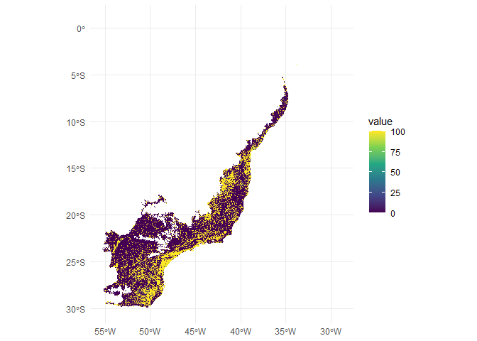
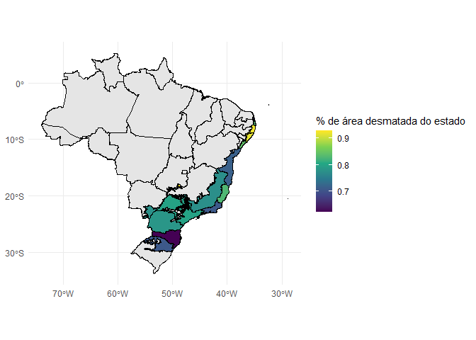

# Analise de desmatamento da Mata Atlântica

> Análise geoespacial do desmatamento da Mata Atlântica, segundo dados
> do [Terrabrasilis](https://terrabrasilis.dpi.inpe.br/downloads/)

# Pacotes

``` r
library(geobr)

library(tidyverse)

library(magrittr)

library(sf)

library(terra)

library(tidyterra)
```

# Dados

## Shapefile da Mata Atlântica

### Importando

``` r
ma <- geobr::read_biomes(year = 2019) |> 
  dplyr::filter(name_biome == "Mata Atlântica")
```

    ## Using year/date 2019

### Visualizando

``` r
ma
```

    ## Simple feature collection with 1 feature and 3 fields
    ## Geometry type: MULTIPOLYGON
    ## Dimension:     XY
    ## Bounding box:  xmin: -55.33475 ymin: -29.98127 xmax: -28.84785 ymax: 0.9178799
    ## Geodetic CRS:  SIRGAS 2000
    ##       name_biome code_biome year                           geom
    ## 1 Mata Atlântica          4 2019 MULTIPOLYGON (((-48.70814 -...

``` r
ggplot() +
  geom_sf(data = ma, color = "darkgreen", fill = "forestgreen", alpha = 0.3)
```

<!-- -->

## Shapefile dos estados do Mata Atlântica

### Importando

``` r
estados <- geobr::read_state(year = 2019)
```

    ## Using year/date 2019

### Visualizando

``` r
estados
```

    ## Simple feature collection with 27 features and 5 fields
    ## Geometry type: MULTIPOLYGON
    ## Dimension:     XY
    ## Bounding box:  xmin: -73.99045 ymin: -33.75118 xmax: -28.84784 ymax: 5.271841
    ## Geodetic CRS:  SIRGAS 2000
    ## First 10 features:
    ##    code_state abbrev_state name_state code_region name_region
    ## 1          11           RO   Rondônia           1       Norte
    ## 2          12           AC       Acre           1       Norte
    ## 3          13           AM   Amazônas           1       Norte
    ## 4          14           RR    Roraima           1       Norte
    ## 5          15           PA       Pará           1       Norte
    ## 6          16           AP      Amapá           1       Norte
    ## 7          17           TO  Tocantins           1       Norte
    ## 8          21           MA   Maranhão           2    Nordeste
    ## 9          22           PI      Piauí           2    Nordeste
    ## 10         23           CE      Ceará           2    Nordeste
    ##                              geom
    ## 1  MULTIPOLYGON (((-65.3815 -1...
    ## 2  MULTIPOLYGON (((-71.07772 -...
    ## 3  MULTIPOLYGON (((-69.83766 -...
    ## 4  MULTIPOLYGON (((-63.96008 2...
    ## 5  MULTIPOLYGON (((-51.43248 -...
    ## 6  MULTIPOLYGON (((-50.45011 2...
    ## 7  MULTIPOLYGON (((-48.23163 -...
    ## 8  MULTIPOLYGON (((-44.5383 -2...
    ## 9  MULTIPOLYGON (((-42.91539 -...
    ## 10 MULTIPOLYGON (((-41.18292 -...

``` r
ggplot() +
  geom_sf(data = estados, color = "darkgreen", fill = "forestgreen", alpha = 0.3)
```

<!-- -->

### Tratando

``` r
estados_ma <- estados |> 
  sf::st_intersection(ma)
```

    ## Warning: attribute variables are assumed to be spatially constant throughout all
    ## geometries

``` r
estados_ma
```

    ## Simple feature collection with 15 features and 8 fields
    ## Geometry type: GEOMETRY
    ## Dimension:     XY
    ## Bounding box:  xmin: -55.33475 ymin: -29.98127 xmax: -28.84824 ymax: -3.804938
    ## Geodetic CRS:  SIRGAS 2000
    ## First 10 features:
    ##    code_state abbrev_state          name_state code_region name_region
    ## 11         24           RN Rio Grande Do Norte           2    Nordeste
    ## 12         25           PB             Paraíba           2    Nordeste
    ## 13         26           PE          Pernambuco           2    Nordeste
    ## 14         27           AL             Alagoas           2    Nordeste
    ## 15         28           SE             Sergipe           2    Nordeste
    ## 16         29           BA               Bahia           2    Nordeste
    ## 17         31           MG        Minas Gerais           3     Sudeste
    ## 18         32           ES      Espírito Santo           3     Sudeste
    ## 19         33           RJ      Rio De Janeiro           3     Sudeste
    ## 20         35           SP           São Paulo           3     Sudeste
    ##        name_biome code_biome year                           geom
    ## 11 Mata Atlântica          4 2019 MULTIPOLYGON (((-35.23148 -...
    ## 12 Mata Atlântica          4 2019 MULTIPOLYGON (((-34.96617 -...
    ## 13 Mata Atlântica          4 2019 MULTIPOLYGON (((-32.39288 -...
    ## 14 Mata Atlântica          4 2019 MULTIPOLYGON (((-36.73955 -...
    ## 15 Mata Atlântica          4 2019 POLYGON ((-36.40824 -10.510...
    ## 16 Mata Atlântica          4 2019 MULTIPOLYGON (((-38.71065 -...
    ## 17 Mata Atlântica          4 2019 MULTIPOLYGON (((-51.00015 -...
    ## 18 Mata Atlântica          4 2019 MULTIPOLYGON (((-29.29958 -...
    ## 19 Mata Atlântica          4 2019 MULTIPOLYGON (((-41.82918 -...
    ## 20 Mata Atlântica          4 2019 MULTIPOLYGON (((-47.85009 -...

``` r
ggplot() +
  geom_sf(data = estados, color = "black") +
  geom_sf(data = estados_ma, color = "darkgreen", fill = "forestgreen", alpha = 0.3)
```

<!-- -->

## Raster de desmatamento

### Importnado

``` r
des_tif <- terra::rast("prodes_mata_atlantica_2024.tif")
```

### Visualizando

``` r
des_tif
```

    ## class       : SpatRaster 
    ## size        : 114909, 98501, 1  (nrow, ncol, nlyr)
    ## resolution  : 0.0002689, 0.0002689  (x, y)
    ## extent      : -55.33482, -28.8479, -29.98113, 0.9179008  (xmin, xmax, ymin, ymax)
    ## coord. ref. : lon/lat SIRGAS 2000 (EPSG:4674) 
    ## source      : prodes_mata_atlantica_2024.tif 
    ## name        : prodes_mata_atlantica_2024

``` r
ggplot() +
  tidyterra::geom_spatraster(data = des_tif) +
  scale_fill_viridis_c(na.value = NA) +
  theme_minimal()
```

    ## <SpatRaster> resampled to 500420 cells.

<!-- -->

# Reamostrando o raster de desmatamento para 1km²

## Criando o raster

``` r
raster_modelo <- rast(res = (30 / 3600), 
                      crs = "EPSG:4326",
                      ext = des_tif |> terra::ext())

raster_modelo
```

    ## class       : SpatRaster 
    ## size        : 3708, 3178, 1  (nrow, ncol, nlyr)
    ## resolution  : 0.008333333, 0.008333333  (x, y)
    ## extent      : -55.33482, -28.85149, -29.98113, 0.9188707  (xmin, xmax, ymin, ymax)
    ## coord. ref. : lon/lat WGS 84 (EPSG:4326)

## Reamostrando

``` r
des_tif
```

    ## class       : SpatRaster 
    ## size        : 114909, 98501, 1  (nrow, ncol, nlyr)
    ## resolution  : 0.0002689, 0.0002689  (x, y)
    ## extent      : -55.33482, -28.8479, -29.98113, 0.9179008  (xmin, xmax, ymin, ymax)
    ## coord. ref. : lon/lat SIRGAS 2000 (EPSG:4674) 
    ## source      : prodes_mata_atlantica_2024.tif 
    ## name        : prodes_mata_atlantica_2024

``` r
des_tif_rea <- des_tif |> 
  terra::resample(raster_modelo)
  
des_tif_rea
```

    ## class       : SpatRaster 
    ## size        : 3708, 3178, 1  (nrow, ncol, nlyr)
    ## resolution  : 0.008333333, 0.008333333  (x, y)
    ## extent      : -55.33482, -28.85149, -29.98113, 0.9188707  (xmin, xmax, ymin, ymax)
    ## coord. ref. : lon/lat SIRGAS 2000 (EPSG:4674) 
    ## source(s)   : memory
    ## name        : prodes_mata_atlantica_2024 
    ## min value   :                          0 
    ## max value   :                        100

``` r
terra::res(des_tif_rea) == terra::res(des_tif)
```

    ## [1] FALSE FALSE

## Visualizando o raster reamostrado

``` r
des_tif_rea
```

    ## class       : SpatRaster 
    ## size        : 3708, 3178, 1  (nrow, ncol, nlyr)
    ## resolution  : 0.008333333, 0.008333333  (x, y)
    ## extent      : -55.33482, -28.85149, -29.98113, 0.9188707  (xmin, xmax, ymin, ymax)
    ## coord. ref. : lon/lat SIRGAS 2000 (EPSG:4674) 
    ## source(s)   : memory
    ## name        : prodes_mata_atlantica_2024 
    ## min value   :                          0 
    ## max value   :                        100

``` r
ggplot() +
  tidyterra::geom_spatraster(data = des_tif_rea) +
  scale_fill_viridis_c(na.value = NA) +
  geom_sf(data = uc, color = "red", fill = NA) +
  theme_minimal()
```

    ## <SpatRaster> resampled to 500420 cells.

<!-- -->

# Comparação da área de desmatamento por estados

## Área dos estados

``` r
area_estados <- estados_ma |> 
  sf::st_transform(crs = 32725) |> 
  sf::st_area() / 1e6 |> 
  as.numeric()

area_estados
```

    ## Units: [m^2]
    ##  [1]   2050.040   4107.735  15485.420  14640.369   9830.588 111223.705 243890.690
    ##  [8]  46778.934  44782.021 215797.211 214325.784 102642.240  95710.275  42034.495
    ## [15]   5972.690

## Área desmatada

``` r
area_raster <- c()

area_desmatada <- function(id){
  
  raster_recortado <- des_tif_rea |>
    terra::crop(estados_ma[id, ]) |> 
    terra::mask(estados_ma[id, ]) |> 
    tidyterra::filter(prodes_mata_atlantica_2024 < 50)
  
  area <- raster_recortado |> terra::expanse(unit = "km")
  
  area_raster <<- c(area_raster, area[1, 2]) 
  
}

n_estados <- estados_ma |> nrow()

n_estados
```

    ## [1] 15

``` r
purrr::walk(1:n_estados, area_desmatada)

area_raster
```

    ##  [1]   1381.980   3412.330  14256.365  13403.530   8272.519  79542.533 188566.695
    ##  [8]  38729.391  31615.304 171971.418 167535.027  63588.997  67541.935  32578.251
    ## [15]   5540.468

## Incorporando os dados ao shapefile

``` r
estados_area <- estados_ma |> 
  dplyr::mutate(`Área desmatada` = area_raster,
                `% de área desmatada do estado` = area_raster / area_estados |>
                  as.numeric())

estados_area
```

    ## Simple feature collection with 15 features and 10 fields
    ## Geometry type: GEOMETRY
    ## Dimension:     XY
    ## Bounding box:  xmin: -55.33475 ymin: -29.98127 xmax: -28.84824 ymax: -3.804938
    ## Geodetic CRS:  SIRGAS 2000
    ## First 10 features:
    ##    code_state abbrev_state          name_state code_region name_region
    ## 11         24           RN Rio Grande Do Norte           2    Nordeste
    ## 12         25           PB             Paraíba           2    Nordeste
    ## 13         26           PE          Pernambuco           2    Nordeste
    ## 14         27           AL             Alagoas           2    Nordeste
    ## 15         28           SE             Sergipe           2    Nordeste
    ## 16         29           BA               Bahia           2    Nordeste
    ## 17         31           MG        Minas Gerais           3     Sudeste
    ## 18         32           ES      Espírito Santo           3     Sudeste
    ## 19         33           RJ      Rio De Janeiro           3     Sudeste
    ## 20         35           SP           São Paulo           3     Sudeste
    ##        name_biome code_biome year                           geom Área desmatada
    ## 11 Mata Atlântica          4 2019 MULTIPOLYGON (((-35.23148 -...       1381.980
    ## 12 Mata Atlântica          4 2019 MULTIPOLYGON (((-34.96617 -...       3412.330
    ## 13 Mata Atlântica          4 2019 MULTIPOLYGON (((-32.39288 -...      14256.365
    ## 14 Mata Atlântica          4 2019 MULTIPOLYGON (((-36.73955 -...      13403.530
    ## 15 Mata Atlântica          4 2019 POLYGON ((-36.40824 -10.510...       8272.519
    ## 16 Mata Atlântica          4 2019 MULTIPOLYGON (((-38.71065 -...      79542.533
    ## 17 Mata Atlântica          4 2019 MULTIPOLYGON (((-51.00015 -...     188566.695
    ## 18 Mata Atlântica          4 2019 MULTIPOLYGON (((-29.29958 -...      38729.391
    ## 19 Mata Atlântica          4 2019 MULTIPOLYGON (((-41.82918 -...      31615.304
    ## 20 Mata Atlântica          4 2019 MULTIPOLYGON (((-47.85009 -...     171971.418
    ##    % de área desmatada do estado
    ## 11                     0.6741233
    ## 12                     0.8307083
    ## 13                     0.9206314
    ## 14                     0.9155186
    ## 15                     0.8415080
    ## 16                     0.7151581
    ## 17                     0.7731607
    ## 18                     0.8279238
    ## 19                     0.7059821
    ## 20                     0.7969121

## Visualizando os mapas

``` r
ggplot() +
  geom_sf(data = estados, color = "black") +
  geom_sf(data = estados_area, 
          color = "black", aes(fill = `Área desmatada`)) +
  scale_fill_viridis_c(na.value = NA) +
  theme_minimal()
```

<!-- -->

``` r
ggplot() +
  geom_sf(data = estados, color = "black") +
  geom_sf(data = estados_area, 
          color = "black", aes(fill = `% de área desmatada do estado`)) +
  scale_fill_viridis_c(na.value = NA) +
  theme_minimal()
```

<!-- -->
